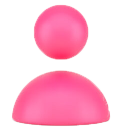
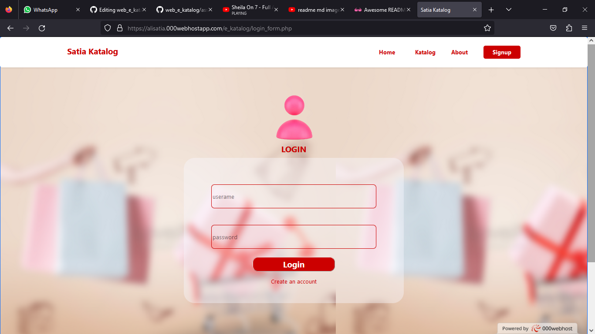
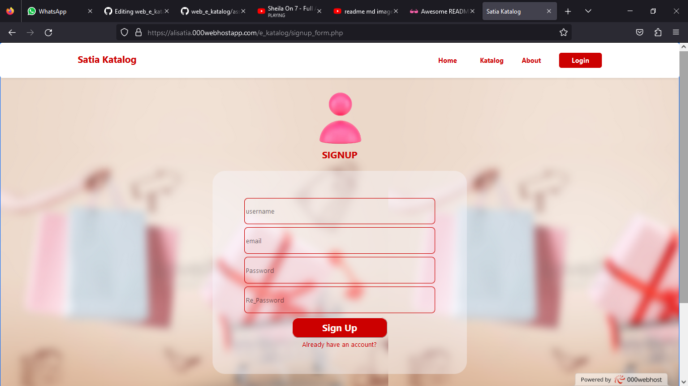
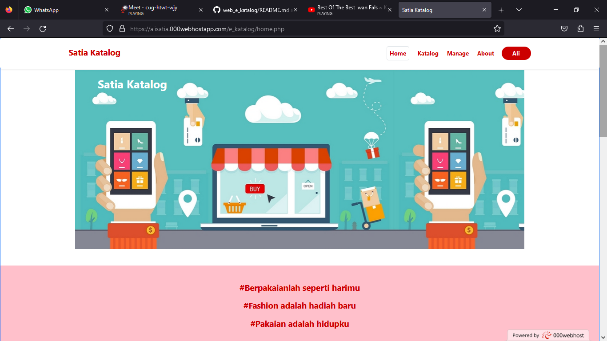
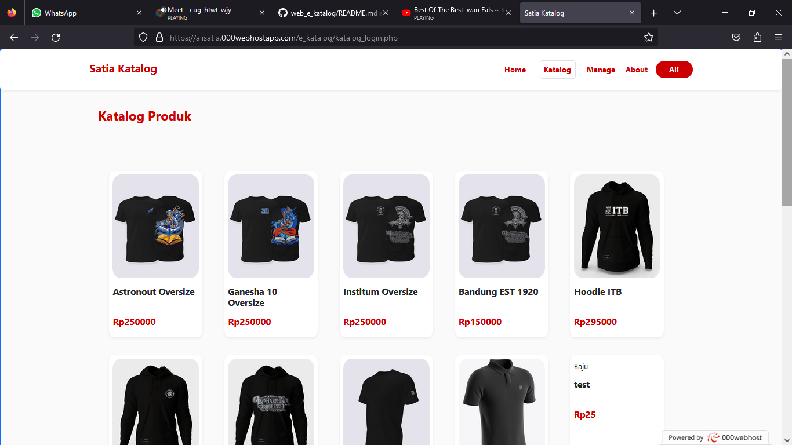
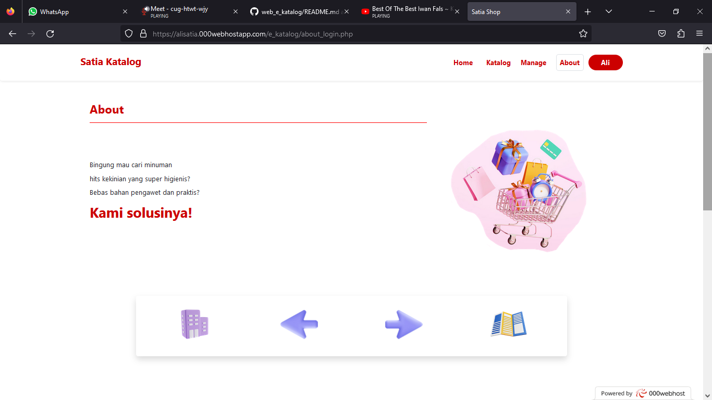
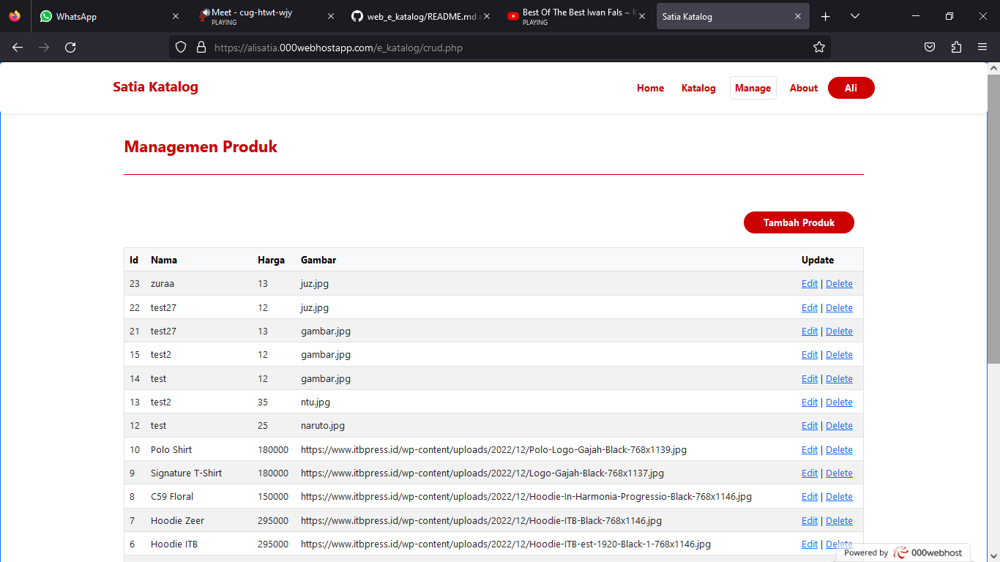
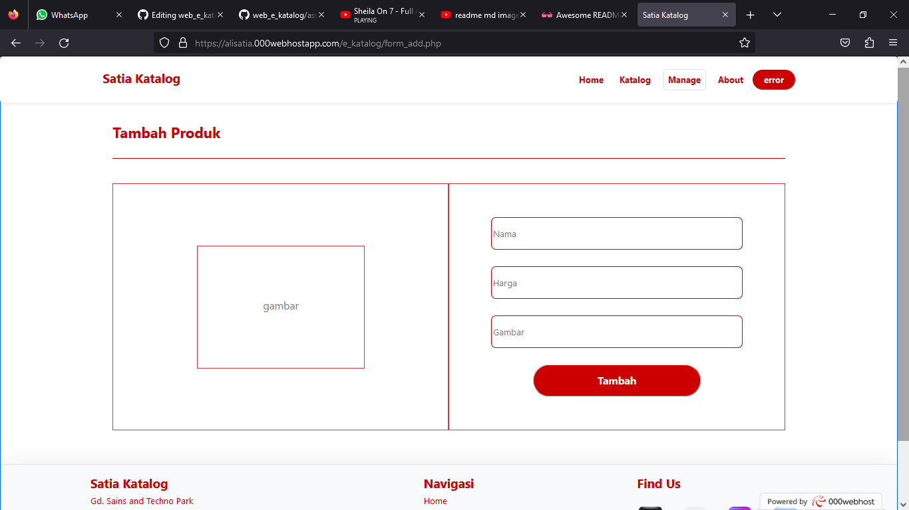
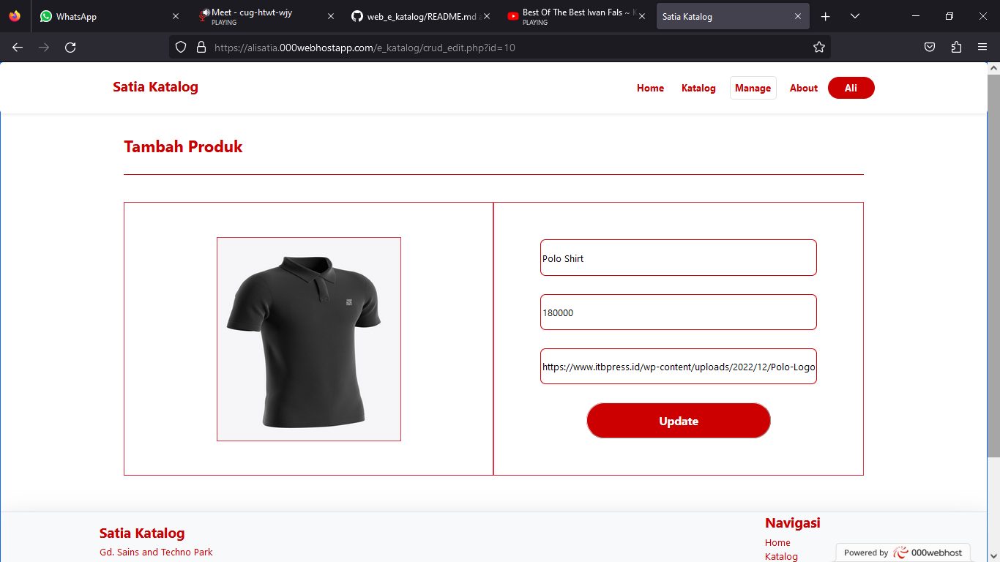
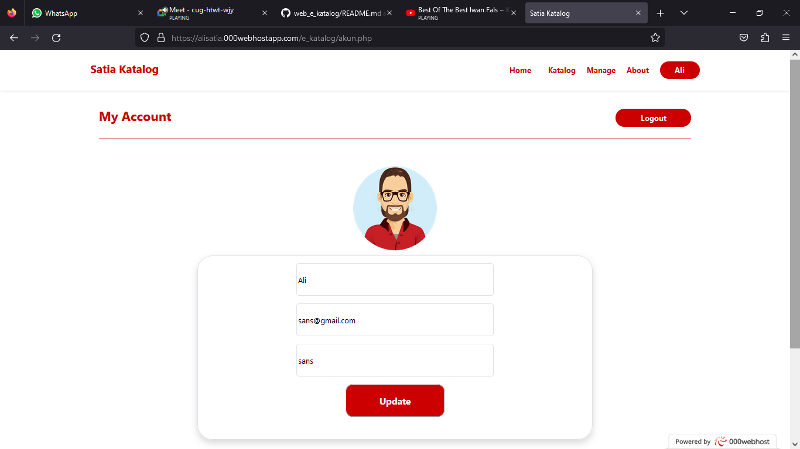

<br />
<div align="center">
  <h1 align="center">E-Katalog</h1>
  
  <p align="center">
    Ahmad Ali Satia - 20552011200 - TIF K 20 CID
    <br></br>
    <a href="https://alisatia.000webhostapp.com/e_katalog"><strong>Buka Website E-Katalog</strong></a>
  </p>
</div>

<details>
  <summary>Table of Contents</summary>
  <ol>
    <li>
      <a href="#project-e-katalog">Project E- Katalog</a>
    </li>
    <li>
      <a href="#backend">Backend</a>
      <ul>
        <li><a href="#koneksi-database">Koneksi Database</a></li>
        <li><a href="#crud">CRUD</a></li>
      </ul>
    </li>
    <li>
	    <a href="#frontend">Frontend</a>
	<ul>
        <li><a href="#ui-login-dan-signup">UI Login dan Signup</a></li>
        <li><a href="#ui-landing-page">UI Landing Page</a></li>
	<li><a href="#ui-manage">UI Manage</a></li>
      </ul>
	</li>
    <li><a href="#screenshot-page">Screenshot Page</a></li>
  </ol>
</details>

<!-- Project E-Katalog -->
## Project E-Katalog

Berkembangnya teknologi informasi yang demikian pesat di millennial sekarang ini sudah mencapai taraf sebagai kebutuhan, sehingg semua lapisan masyarakat tergerak untuk maju dan menggunakannya. Komputer dan smartphone merupakan contoh dari teknologi informasi yang digunakan hampir disetiap kegiatan masyarakat. Bermunculannya gadget-gadget yang canggih dianggap sangat membantu manusia dalam memecahkan berbagai masalah yang di hadapi.

Perkembangan teknologi informasi ini senantiasa diterapkan dalam beberapa bisnis, salah satunya jenis bisnis apparel. Berbagai jenis software yang dapat di akses dari smartphone seperti e commerce yang cukup berperan dalam penjualan. Tidak hanya dalam penjualan, dengan adanya teknologi informasi ini juga membantu dalam membuat iklan produk sebagai sarana pemasaran, melihat dan menganalisis pasar saat ini, dan membuat katalog digital.

Dengan adanya e-katalog atau katalog digital dapat membantu bisnis apparel agar dapat memampang semua produk. Dengan di pampangnya semua produk maka akan membantu pelanggan dengan cepat menembukan produk yang dicari. Dengan begitu semua sisi antara penjual dan pelanggan dapat termudahkan.  

<p align="right">(<a href="#readme-top">back to top</a>)</p>


<!-- backend -->
## Backend

Script menggunakan framework bootstrap, untuk ke backend menggunakan php dan database menggunakan mysql

### Koneksi Database

script php untuk mengkoneksikan ke database. 
* php ke mysql
  ```sh
  $sname= "localhost";
  $unmae= "root";
  $password = "";
  $db_name = "website";
  $conn = mysqli_connect($sname, $unmae, $password, $db_name);
  ```

### CRUD

Create Read Update dan Delete menggunakan script standar dari php

1. Create

    Create menggunakan query database yaitu INSERT INTO yang kemudian disesuaikan dengan field-field yang akan ditambahkan.
* create akun
   ```sh
    <?php
    include_once("db_conn.php");
    if (isset($_POST['user']) && isset($_POST['password']) && isset($_POST['email']) && isset($_POST['re_password'])) {
      $uname = validate($_POST['user']);
	  $pass = validate($_POST['password']);
	  $re_pass = validate($_POST['re_password']);
	  $email = validate($_POST['email']);
	  $user_data = 'user='. $uname. '&email='. $email;
      $sql2 = "INSERT INTO tb_user ( email, username, password) VALUES('$email', '$uname', '$pass')";
      $result2 = mysqli_query($conn, $sql2);
    }
   ?>
   ```
 * create produk
   ```sh
    <?php
    include_once("db_conn.php");
    if(isset($_POST['Submit'])) {	
      $nama = mysqli_real_escape_string($conn, $_POST['nama']);
      $harga = mysqli_real_escape_string($conn, $_POST['harga']);
      $gambar = mysqli_real_escape_string($conn, $_POST['gambar']);
      $result = mysqli_query($conn, "INSERT INTO tb_product (nama,gambar,harga) VALUES ('$nama','$gambar','$harga')");
      header("Location: crud.php");
    }
    ?>
   ```
2. Read
    
    Read menggunakan query database SELECT * untuk menggambil semua data yang ada di database.
 * create produk
   ```sh
    <?php
    include_once("db_conn.php");
    $result = mysqli_query($conn, "SELECT * FROM tb_product ORDER BY id DESC");
    while($res = mysqli_fetch_array($result)) { 		
    echo "<tr>";
    echo "<td>".$res['id']."</td>";
    echo "<td>".$res['nama']."</td>";
    echo "<td>".$res['harga']."</td>";
    echo "<td>".$res['gambar']."</td>";	
    echo "<td><a href=\"crud_edit.php?id=$res[id]\">Edit</a> |
          <a href=\"crud_delete.php?id=$res[id]\" onClick=\"return confirm('hapus produk?')\">Delete</a></td>";		
    }
    ?>
   ```
3. Update

    Read menggunakan query database SELECT * untuk menggambil semua data yang ada di database
 * update product
   ```sh
   if(isset($_POST['update']))
	{	
	$id = mysqli_real_escape_string($conn, $_POST['id']);
	$nama = mysqli_real_escape_string($conn, $_POST['nama']);
	$harga = mysqli_real_escape_string($conn, $_POST['harga']);
	$gambar = mysqli_real_escape_string($conn, $_POST['gambar']);	
	$result = mysqli_query($conn, "UPDATE tb_product SET nama='$nama', gambar='$gambar', harga='$harga' WHERE id=$id");
	header("Location: crud.php");
	}
   ```
4. Delete

     Delete megguakan query database DELETE dengan mengambil Id sebagai patokan
 * delete 
   ```sh
   <?php
	include("db_conn.php");
	$id = $_GET['id'];
	$result = mysqli_query($conn, "DELETE FROM tb_product WHERE id=$id");
	header("Location:crud.php");
	?>
   ```

## Frontend

Untuk frontend menggunakan bootstrap 5.2 dan css murni sebagai tambahan.
### UI Login dan Signup
   Login dan Sign in menggunakan display flex agar mudah di atur lewat bootstrap, menggunakan form action agar langsung terkoneksi dengan page crud nya
* Login dan Signup
   ```sh
	<div class="content d-flex align-items-center" style="height: 700px; margin-top: 70px; background-image: url('assets/background2.png'); ">
	<div class="d-flex flex-column justify-content-center  align-items-center w-50 m-auto h-75">
	<div class="w-75 h-25 d-flex flex-column justify-content-center  align-items-center">
	<div class="d-flex justify-content-center  align-items-center w-100">
	
	</div>
	<div class="fw-bold fs-4" style="color: #cc0000">LOGIN</div>
	</div>
	<div class="mt-4 w-75 h-75 d-flex justify-content-center  align-items-center rounded-5" style="background: rgba(248, 248, 255, .4)">
	<form action="login.php" method="post" class="d-flex flex-column w-75 h-75">
	<?php if (isset($_GET['error'])) { ?>
	<p class="error fw-bold fs-5 mx-auto text-danger"><?php echo $_GET['error']; ?></p>
	<?php } ?>
	<input class="bg-transparent my-4 rounded-3" style="height: 25%;border: 1px solid #cc0000" type="text" name="user" placeholder="userame"><br>
	<input class="bg-transparent my-4 rounded-3" style="height: 25%;border: 1px solid #cc0000" type="password" name="pass" placeholder="password"><br>
	<button class="w-50 rounded-4 mx-auto text-white fw-bold fs-4" style="background-color: #cc0000; height: 15%" type="submit">Login</button>
	<a class="mx-auto mt-3" style="text-decoration: none; color: #cc0000" href="signup.php" class="ca">Create an account</a>
	</form>
	</div>
	</div>
	</div>
   ```
   
### UI Landing Page
   Landing page menggunakan dislpay flac untuk memasukan konten sejajar kebawah. didalamnya terdapat foto diambil menggunakan 
* Home
   ```sh
	<div class="content d-flex align-items-center" style="margin-top: 80px; ">
        <div class="subcontent d-flex flex-column w-100">
          <div class="w-75 mx-auto" style="height: 450px; background-image: url('assets/background3.jpeg');">
            <div class="fs-2 fw-bold mt-3 mx-auto text-white" style="width: 90%">Satia Katalog</div>
          </div>
          <div class="w-100 my-5 d-flex flex-column align-items-center justify-content-center" style="height: 200px; background-color: #ffc0cb">
            <div class="fs-4 fw-bold my-2" style="color:#cc0000">#Berpakaianlah seperti harimu</div>
            <div class="fs-4 fw-bold my-2" style="color:#cc0000">#Fashion adalah hadiah baru</div>
            <div class="fs-4 fw-bold  my-2" style="color:#cc0000">#Pakaian adalah hidupku</div>
          </div>
          <div class="w-100 d-flex flex-column align-items-center justify-content-center" style="background-color: #f3f3f3; height: 700px">
            <div class="d-flex flex-row">
              <div class="shadow-sm p-3 bg-body rounded d-flex flex-column align-items-center justify-content-center" style="height: 300px; width: 300px">
                
                <div class="fw-bold fs-5">Menyediakan E-Katalog</div>
              </div>
              <div class="shadow-sm p-3 bg-body rounded d-flex flex-column align-items-center justify-content-center" style="height: 300px; width: 300px">
                
                <div class="fw-bold fs-5 mt-3">Bisa Menambah Katalog</div>
              </div>
            </div>
            <div class="d-flex flex-row">
            <div class="shadow-sm p-3 bg-body rounded d-flex flex-column align-items-center justify-content-center" style="height: 300px; width: 300px">
                
                <div class="fw-bold fs-5 mt-3">Bagi Hasil</div>
              </div>
              <div class="shadow-sm p-3 bg-body rounded d-flex flex-column align-items-center justify-content-center" style="height: 300px; width: 300px">
                
                <div class="fw-bold fs-5 mt-3">Free Akses Semua Fitur</div>
              </div>
            </div>
        </div>
        <div class="w-100 my-5 d-flex flex-row align-items-center justify-content-center" style="height: 200px; background-color: #f3f3f3">
        </img>
        </img>
        </img>
        </div>
        <div class="w-100">
        <div class="card shadow-sm p-3 mb-5 bg-body rounded m-auto" style="height: 250px; width: 200px">
        
        <p class="mx-auto fw-bold">Ahmad Ali Satia</p>
        <p class="mx-auto fw-bold">20552011200</p>
        </div>
        </div>
        </div>
	</div>
   ```
### UI Manage
   Manage menggunakan tabel untuk memasukan konten dari databse yang diambil. Dalam tabel tiap produk menggunakan link delete dan update untuk mengapdate data
* Manage
   ```sh
	<div class="content d-flex flex-column align-items-center min-vh-100" style="margin-top: 70px;'); ">
           <div class="w-75 mt-5 d-flex pb-4" style="border-bottom: solid 1px #cc0000">
               <h3 class="fw-bold" style="color: #cc0000">Managemen Produk</h3>
                </div>
                <div class="w-75 my-5 min-vh-100 d-flex flex-column">
                    <h4 class="d-flex justify-content-end" >
                        <a class="btn text-white fw-bold rounded-pill m-3" style="width: 15%; background-color:#cc0000" href="form_add.php">Tambah Produk</a>
                    </h4>
                    <table class="table table-striped border">
                        <thead class="table-light">
                            <tr>
                            <th scope="col">Id</th>
                            <th scope="col">Nama</th>
                            <th scope="col">Harga</th>
                            <th scope="col">Gambar</th>
                            <th scope="col">Update</th>
                            </tr>
                        </thead>
                        <tbody>
                            <?php 
                                while($res = mysqli_fetch_array($result)) { 		
                                    echo "<tr>";
                                    echo "<td>".$res['id']."</td>";
                                    echo "<td>".$res['nama']."</td>";
                                    echo "<td>".$res['harga']."</td>";
                                    echo "<td>".$res['gambar']."</td>";	
                                    echo "<td><a href=\"crud_edit.php?id=$res[id]\">Edit</a> | <a href=\"crud_delete.php?id=$res[id]\" onClick=\"return confirm('hapus produk?')\">Delete</a></td>";		
                                }
                            ?>
                        </tbody>
                    </table>
                </div>
	   </div>
	```

<!-- screenshot-page -->
## Screenshot Page

Screenshot diambil dari website 000webhost setelah project di hosting

*Halaman Login
<p align="center">
  
</p>

*Halaman Signup
<p align="center">
  
</p>

*Halaman Utama
<p align="center">
  
</p>

*Halaman Katalog
<p align="center">
  
</p>

*Halaman About
<p align="center">
  
</p>

*Halaman Manage
<p align="center">
  
</p>

*Halaman Tambah Produk
<p align="center">
  
</p>

*Halaman Edit Produk
<p align="center">
  
</p>

*Halaman Edit User
<p align="center">
  
</p>
